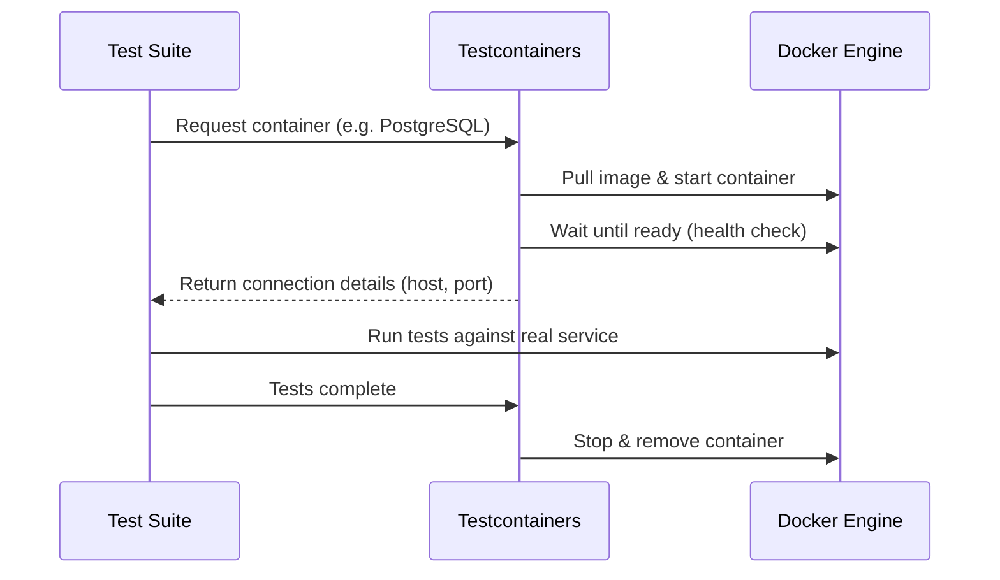
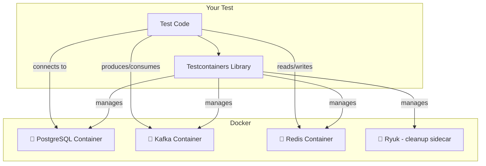

# Introduction to Testcontainers

Ghislain Gabriëlse

<!--
Welcome everyone! Today I'm going to talk about Testcontainers — a tool that has fundamentally changed how I think about integration testing. By the end of this session, you'll understand what Testcontainers is, why it's better than traditional mocking for integration tests, and how to start using it in your own projects.
-->

---
hideInToc: true
---

# Ghislain Gabriëlse

Test Automation Consultant <a href="https://detesters.nl/">DeTesters</a>

- Woerden, Netherlands 🇳🇱
- 36 years
- Father of 2 minions
- Butler to a cat
- ~12 years of experience
- Builds Tools that simplify complex tasks

<!--
A quick intro about myself. I'm Ghislain, a test automation consultant at DeTesters. I've been in the testing space for about 12 years now, and I'm passionate about building tools that make testing easier and more reliable. Testcontainers is one of those tools that I wish I had discovered earlier in my career.
-->

---
hideInToc: true
---

# Agenda

<Toc text-xs minDepth="1" maxDepth="1" />

<!--
Here's what we'll cover today. We'll start with what Testcontainers actually is, then look at the problems with traditional mocking approaches, discuss the benefits, walk through how it works under the hood, see some real code examples, and finish with best practices.
-->

---
layout: section
---

# What is Testcontainers?

---
layout: default
hideInToc: true
---

# What is Testcontainers?

Testcontainers is an open-source library that provides lightweight, throwaway instances of real services wrapped in Docker containers.

<div class="grid grid-cols-2 gap-8 mt-8">
<div>

### In a nutshell

- Programmatically start Docker containers from your tests
- Spin up **real** databases, message brokers, browsers, and more
- Containers are created before the test and destroyed after
- Available for Java, Node.js, Python, .NET, Go, Rust, and more

</div>
<div>

### Supported by

- 🐘 **Databases** — PostgreSQL, MySQL, MongoDB, Redis
- 📨 **Messaging** — Kafka, RabbitMQ, Pulsar
- 🌐 **Cloud** — LocalStack (AWS), Azure, GCP emulators
- 🧩 **And much more** — Elasticsearch, Keycloak, Selenium, ...

</div>
</div>

<!--
So what is Testcontainers? In short, it's a library that lets you spin up real services — like databases or message brokers — inside Docker containers, directly from your test code. The key word here is "real." You're not faking anything. You're running the actual PostgreSQL, the actual Kafka, the actual Redis. The containers are lightweight and throwaway — they spin up before your tests and are destroyed after. And it's not just for Java; there are implementations for most popular languages.
-->

---
layout: section
---

# Mocking vs Real Services

---
layout: default
hideInToc: true
---

# The Traditional Approach

When testing code that depends on external services, developers typically resort to:


- **Mocks** — Simulate behavior at the interface level
- **Stubs** — Return canned responses
- **In-memory replacements** — H2 instead of PostgreSQL, fakes instead of real services
- **Shared test environments** — A single dev/test database everyone connects to

<!--
Let's talk about what most of us do today when we need to test code that talks to a database or an external service. We mock it, we stub it, we use in-memory replacements like H2 instead of a real PostgreSQL, or we all point at a shared test database. These approaches work — to a degree — but they come with real trade-offs. Let me show you what I mean.
-->

---
layout: default
hideInToc: true
---

# Where Mocking Falls Short

<div class="grid grid-cols-2 gap-12 mt-4">
<div>

### 😬 The Risks

- **Behavior drift** — Mocks don't update when the real service changes
- **False confidence** — Tests pass, production breaks
- **SQL dialect gaps** — H2 doesn't behave like PostgreSQL
- **Missing edge cases** — Timeouts, connection limits, constraints
- **Complex setup** — Mocking deep dependency trees is painful

</div>
<div>

### 🤔 A Common Scenario

```java
// This test passes...
when(repo.save(any()))
    .thenReturn(savedEntity);

// But in production, a UNIQUE constraint
// violation causes a 500 error because
// we never tested against a real database.
```

> "Your mocks are only as good as your assumptions about the real system."

</div>
</div>

<!--
Here's where things get tricky. Mocks don't evolve with the real service. If someone adds a NOT NULL constraint to the database, your mock won't catch that. H2 has subtle SQL differences compared to PostgreSQL — I've personally seen tests pass on H2 and fail on production Postgres because of JSON operator differences. And look at this code example: the mock happily returns a saved entity, but in production, a UNIQUE constraint violation would blow up. Your mocks are only as good as your assumptions — and assumptions age badly.
-->

---
layout: default
hideInToc: true
---

# Why Testcontainers?

| Aspect | Mocking / Stubs | Testcontainers |
|---|---|---|
| **Fidelity** | Simulated behavior | Real service behavior |
| **SQL Dialect** | Generic (H2) | Exact production DB |
| **Environment** | No infra needed | Docker required |
| **Speed** | Very fast | Slightly slower |
| **Confidence** | Medium | High |
| **Isolation** | Per-test by design | Per-test containers |
| **Maintenance** | Keep mocks in sync | Self-updating |

> 💡 Testcontainers doesn't replace **all** mocking — it shines for **integration tests**.

<!--
Let's compare the two approaches side by side. The big wins for Testcontainers are fidelity and confidence — you're testing against the real thing, so you can trust the results. The trade-off is speed: containers take a few seconds to start, whereas mocks are instant. But here's the important nuance — Testcontainers is not meant to replace all your mocks. Unit tests with mocks are still great for fast feedback. Testcontainers is for your integration tests, where you need to know that the pieces actually fit together.
-->

---
layout: default
hideInToc: true
---

# Key Benefits

<div class="grid grid-cols-2 gap-8 mt-4">
<div>

### 🎯 Test against real services
No more behavior drift — your tests run against the same database engine as production.

### 🏝️ Complete isolation
Every test run gets fresh containers. No shared state, no flaky tests from leftover data.

### 🔄 Reproducible everywhere
Works the same on your laptop and in CI. No "works on my machine" problems.

</div>
<div>

### ⚡ Easy to set up
A few lines of code to spin up a fully configured PostgreSQL, Kafka, or Redis instance.

### 📦 No external infrastructure
No need to maintain shared test databases or services. Just Docker.

### 🧹 Automatic cleanup
Containers are automatically stopped and removed when tests finish. The **Ryuk** sidecar ensures nothing leaks.

</div>
</div>

<!--
Let me highlight the benefits that matter most in practice. First, you're testing against the real thing — no behavior drift. Second, every test run starts clean. If you've ever dealt with flaky tests because someone else's test left data in a shared database, you know how valuable this is. Third, it works the same everywhere — your laptop, your colleague's laptop, CI. Fourth, setup is trivial — a few lines of code. And finally, cleanup is automatic. There's a sidecar container called Ryuk that tracks everything and cleans up even if your test crashes. You don't have to worry about leaked containers.
-->

---
layout: section
---

# How It Works

---
layout: default
hideInToc: true
---

# Testcontainers Lifecycle



<!--
Here's the lifecycle. Your test asks Testcontainers for a container — say PostgreSQL. The library pulls the Docker image if needed, starts the container, and then waits until it's actually ready — not just "running," but ready to accept connections. This is important because Docker's "running" state doesn't mean the service inside is ready. Once it's healthy, Testcontainers gives your test the connection details — host, port, JDBC URL — and your test runs against it. When tests are done, the container is stopped and removed. Clean slate every time.
-->

---
layout: default
hideInToc: true
---

# Architecture



**Ryuk** is a special sidecar container that Testcontainers starts automatically. It tracks all containers created during the test session and cleans them up — even if your test crashes.

<!--
From an architecture perspective, your test code talks to the Testcontainers library, which manages containers through the Docker API. You can have multiple containers running at once — a database, a message broker, a cache — whatever your application needs. And notice Ryuk in the corner there. It's a special cleanup container that Testcontainers starts automatically. It keeps track of all containers created during the session and ensures they're cleaned up, even if your test process gets killed or crashes unexpectedly. It's a safety net that prevents Docker from filling up with orphaned containers.
-->

---
layout: default
hideInToc: true
---

# Example 1 — PostgreSQL Integration Test

```java {all|2-7|9-13|16-21}{maxHeight:'420px'}
@Testcontainers
class UserRepositoryTest {
    @Container
    static PostgreSQLContainer<?> postgres =
        new PostgreSQLContainer<>("postgres:16-alpine")
            .withDatabaseName("testdb")
            .withUsername("test").withPassword("test");

    @DynamicPropertySource
    static void configure(DynamicPropertyRegistry registry) {
        registry.add("spring.datasource.url", postgres::getJdbcUrl);
        registry.add("spring.datasource.username", postgres::getUsername);
        registry.add("spring.datasource.password", postgres::getPassword);
    }

    @Autowired UserRepository userRepository;

    @Test
    void shouldPersistAndRetrieveUser() {
        userRepository.save(new User("Ghislain", "ghislain@example.com"));
        Optional<User> found = userRepository.findByEmail("ghislain@example.com");
        assertThat(found).isPresent();
        assertThat(found.get().getName()).isEqualTo("Ghislain");
    }
}
```

<!--
Let's look at some real code. This is a Spring Boot test that verifies a UserRepository against an actual PostgreSQL database. The @Testcontainers annotation tells JUnit to manage the container lifecycle. The @Container annotation marks our PostgreSQL container — we're using the official postgres:16-alpine image and configuring database name, username, and password. The @DynamicPropertySource method is the magic glue — it injects the container's JDBC URL, username, and password into Spring's configuration at runtime. Notice we never hardcode a port — Testcontainers maps to a random available port. The test itself is clean and simple: save a user, find it by email, assert it's there. And this is running against real PostgreSQL — not H2, not a mock.
-->

---
layout: default
hideInToc: true
---

# Example 2 — REST API + Database Test

```java {all|1-3|5-11|14-22}{maxHeight:'420px'}
@SpringBootTest(webEnvironment = RANDOM_PORT)
@Testcontainers
class ProductApiTest {
    @Container
    static PostgreSQLContainer<?> postgres =
        new PostgreSQLContainer<>("postgres:16-alpine");

    @DynamicPropertySource
    static void configure(DynamicPropertyRegistry registry) {
        registry.add("spring.datasource.url", postgres::getJdbcUrl);
        registry.add("spring.datasource.username", postgres::getUsername);
        registry.add("spring.datasource.password", postgres::getPassword);
    }

    @Autowired TestRestTemplate restTemplate;

    @Test
    void shouldCreateAndRetrieveProduct() {
        var product = new Product("Testcontainers T-Shirt", 29.99);
        var created = restTemplate.postForEntity("/api/products", product, Product.class);
        assertThat(created.getStatusCode()).isEqualTo(HttpStatus.CREATED);

        var found = restTemplate.getForEntity(
            "/api/products/" + created.getBody().getId(), Product.class);
        assertThat(found.getBody().getName()).isEqualTo("Testcontainers T-Shirt");
    }
}
```

<!--
This second example takes it up a notch. We're now testing a full REST API — a Spring Boot app with a real database behind it. The setup is almost identical: same PostgreSQL container, same DynamicPropertySource wiring. But now we're using TestRestTemplate to make actual HTTP calls to our API endpoints. We POST a product, verify we get a 201 Created back, then GET it by ID and verify the data came through correctly. This is a true end-to-end integration test — HTTP request, through the controller, service layer, repository, into a real PostgreSQL database and back. If there's a serialization issue, a constraint violation, or a query bug, this test will catch it.
-->

---
layout: default
hideInToc: true
---

# Example 3 — GenericContainer (Any Docker Image)

Not limited to pre-built modules — use **any** Docker image:

```java {all|3-5|8-14}
@Testcontainers
class CustomServiceTest {
    @Container
    static GenericContainer<?> wiremock = new GenericContainer<>("wiremock/wiremock:3.5.4")
        .withExposedPorts(8080)
        .waitingFor(Wait.forHttp("/__admin/mappings").forStatusCode(200));

    @Test
    void shouldConnectToWiremock() {
        String baseUrl = "http://" + wiremock.getHost()
            + ":" + wiremock.getMappedPort(8080);
        given().baseUri(baseUrl)
            .when().get("/__admin/mappings")
            .then().statusCode(200);
    }
}
```

> 💡 `GenericContainer` — if it runs in Docker, you can test with it.

<!--
Now here's where it gets really powerful. Testcontainers isn't limited to databases — you can run any Docker image using GenericContainer. In this example, we're spinning up a WireMock server to simulate an external API. We expose port 8080, and we use a wait strategy to make sure the WireMock admin API is responding before our test starts. Then we use getMappedPort to get the actual port Docker assigned. This pattern is great for testing against services that don't have a dedicated Testcontainers module yet. Basically, if it runs in Docker, you can use it in your tests.
-->

---
layout: section
---

# Best Practices

---
layout: default
hideInToc: true
---

# Tips for Real-World Usage

<div class="grid grid-cols-2 gap-8 mt-4">
<div>

### ✅ Do

- **Reuse containers** across tests (`static` + `@Container`)
- **Use `@DynamicPropertySource`** — don't hardcode ports
- **Pin image tags** (e.g. `postgres:16-alpine`)
- **Use `.waitingFor()`** strategies

</div>
<div>

### ❌ Avoid

- New container per test method — it's slow
- Fixed ports — use `getMappedPort()` instead
- Replacing **all** mocks — unit tests are still valuable

</div>
</div>

<div class="mt-6 text-center">

### The Testing Sweet Spot

`Unit Tests (mocks) ⚡ → Integration Tests (Testcontainers) 🎯 → E2E Tests 🐢`

</div>

<!--
A few tips from real-world experience. First, make your containers static and reuse them across test methods — spinning up a new PostgreSQL for every single test is wasteful when you can just clear the data between tests. Always use DynamicPropertySource or equivalent — never hardcode ports, because Testcontainers maps to random ports each time. Pin your image tags — using :latest might surprise you when an image update changes behavior. And use wait strategies so your tests don't start before the container is actually ready. On the flip side, don't go overboard replacing every mock with a container. Unit tests with mocks are still fast and valuable. Think of it as a testing pyramid — mocks for unit tests, Testcontainers for integration tests, and a few end-to-end tests at the top.
-->

---
layout: default
hideInToc: true
---

# Getting Started

Add Testcontainers to your project:

```xml
<!-- Maven -->
<dependency>
    <groupId>org.testcontainers</groupId>
    <artifactId>testcontainers</artifactId>
    <version>1.20.4</version>
    <scope>test</scope>
</dependency>
<dependency>
    <groupId>org.testcontainers</groupId>
    <artifactId>postgresql</artifactId>
    <version>1.20.4</version>
    <scope>test</scope>
</dependency>
```

**Prerequisites:**
- Docker installed and running
- JUnit 5
- That's it! 🎉

📚 Docs: [testcontainers.com](https://testcontainers.com)  
💻 GitHub: [github.com/testcontainers](https://github.com/testcontainers)

<!--
Getting started is straightforward. Add the Testcontainers BOM and the module you need — here we're adding the core library and the PostgreSQL module. You need Docker installed and running, and JUnit 5. That's literally it. No complex infrastructure setup, no test environment provisioning. The official docs at testcontainers.com are excellent and have examples for every supported module.
-->

---
layout: default
hideInToc: true
---

# Thank You!

<div class="mt-8 text-center text-xl">

Questions? 🙋

</div>

<div class="mt-12 text-center">

📚 [testcontainers.com](https://testcontainers.com) — Official documentation  
💻 [github.com/testcontainers](https://github.com/testcontainers) — Source code & examples  
🐘 [testcontainers.com/modules](https://testcontainers.com/modules/) — Browse all available modules

</div>

<!--
That wraps up the presentation! To summarize: Testcontainers lets you test against real services in Docker, giving you much higher confidence than mocks for integration tests. It's easy to set up, fully isolated, reproducible, and cleans up after itself. I'd encourage you to try it on your next project — start with one integration test against a real database and see how it feels. Happy to take any questions!
-->
