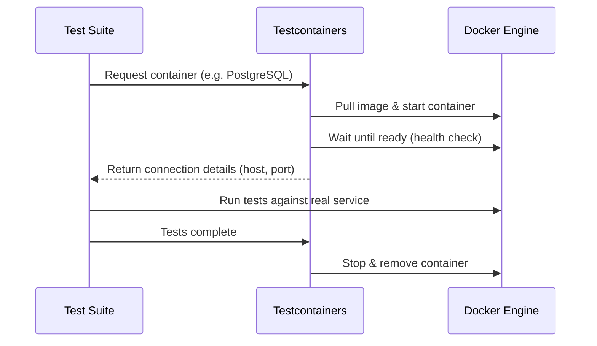
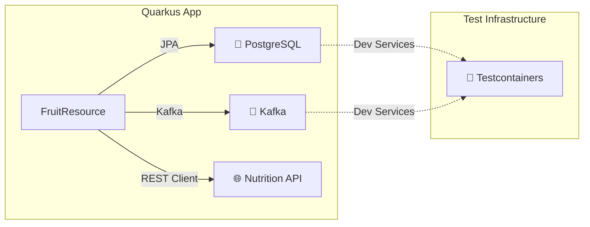

# Introduction to Testcontainers

Ghislain Gabriëlse


<!--
Welcome everyone! Today I'm going to talk about Testcontainers — a tool that has fundamentally changed how I think about integration testing. By the end of this session, you'll understand what Testcontainers is, why it's better than traditional mocking for integration tests, and how to start using it in your own projects.
-->

---
hideInToc: true
---

# Ghislain Gabriëlse

Test Automation Consultant <a href="https://detesters.nl/">DeTesters</a>

- Woerden, Netherlands 🇳🇱
- 36 years
- Father of 2 minions
- Butler to a cat
- ~12 years of experience
- Builds Tools that simplify complex tasks

<!--
A quick intro about myself. I'm Ghislain, a test automation consultant at DeTesters. I've been in the testing space for about 12 years now, and I'm passionate about building tools that make testing easier and more reliable. Testcontainers is one of those tools that I wish I had discovered earlier in my career.
-->

---
hideInToc: true
---

# Agenda

<Toc text-xs minDepth="1" maxDepth="1" />

<!--
Here's what we'll cover today. We'll start with what Testcontainers actually is, then look at the problems with traditional mocking approaches, discuss the benefits, walk through how it works under the hood, see some real code examples, and finish with best practices.
-->

---
layout: section
---

# What is Testcontainers?

---
layout: default
hideInToc: true
---

# What is Testcontainers?

Testcontainers is an open-source library that provides lightweight, throwaway instances of real services wrapped in Docker containers.

<div class="grid grid-cols-2 gap-8 mt-8">
<div>

### In a nutshell

- Programmatically start Docker containers from your tests
- Spin up **real** databases, message brokers, browsers, and more
- Containers are created before the test and destroyed after
- Available for Java, Node.js, Python, .NET, Go, Rust, and more

</div>
<div>

### Supported by

- 🐘 **Databases** — PostgreSQL, MySQL, MongoDB, Redis
- 📨 **Messaging** — Kafka, RabbitMQ, Pulsar
- 🌐 **Cloud** — LocalStack (AWS), Azure, GCP emulators
- 🧩 **And much more** — Elasticsearch, Keycloak, Selenium, ...

</div>
</div>

<!--
So what is Testcontainers? In short, it's a library that lets you spin up real services — like databases or message brokers — inside Docker containers, directly from your test code. The key word here is "real." You're not faking anything. You're running the actual PostgreSQL, the actual Kafka, the actual Redis. The containers are lightweight and throwaway — they spin up before your tests and are destroyed after. And it's not just for Java; there are implementations for most popular languages.
-->

---
layout: section
---

# Mocking vs Real Services

---
layout: default
hideInToc: true
---

# Where Mocking Falls Short

<div class="grid grid-cols-2 gap-12 mt-4">
<div>

### 😬 The Risks

- **Behavior drift** — Mocks don't update when the real service changes
- **False confidence** — Tests pass, production breaks
- **SQL dialect gaps** — H2 doesn't behave like PostgreSQL
- **Missing edge cases** — Timeouts, connection limits, constraints

</div>
<div>

### 🤔 A Common Scenario

```java
// This test passes...
when(repo.save(any()))
    .thenReturn(savedEntity);

// But in production, a UNIQUE constraint
// violation causes a 500 error because
// we never tested against a real database.
```

</div>
</div>

> "Your mocks are only as good as your assumptions about the real system."

<!--
Most of us mock, stub, use H2 instead of real PostgreSQL, or share a test database. These approaches work to a degree, but they come with real trade-offs. Mocks don't evolve with the real service. H2 has subtle SQL differences compared to PostgreSQL. Look at this code example: the mock happily returns a saved entity, but in production, a UNIQUE constraint violation would blow up. Your mocks are only as good as your assumptions — and assumptions age badly.
-->

---
layout: default
hideInToc: true
---

# Why Testcontainers?

| Aspect | Mocking / Stubs | Testcontainers |
|---|---|---|
| **Fidelity** | Simulated behavior | Real service behavior |
| **SQL Dialect** | Generic (H2) | Exact production DB |
| **Speed** | Very fast | Slightly slower |
| **Confidence** | Medium | High |
| **Maintenance** | Keep mocks in sync | Self-updating |

> 💡 Testcontainers doesn't replace **all** mocking — it shines for **integration tests**.

<!--
Let's compare the two approaches side by side. The big wins for Testcontainers are fidelity and confidence — you're testing against the real thing, so you can trust the results. The trade-off is speed: containers take a few seconds to start, whereas mocks are instant. But here's the important nuance — Testcontainers is not meant to replace all your mocks. Unit tests with mocks are still great for fast feedback. Testcontainers is for your integration tests, where you need to know that the pieces actually fit together.
-->

---
layout: default
hideInToc: true
---

# Key Benefits

<div class="grid grid-cols-2 gap-8 mt-4">
<div>

### 🎯 Test against real services
No more behavior drift — your tests run against the same database engine as production.

### 🏝️ Complete isolation
Every test run gets fresh containers. No shared state, no flaky tests from leftover data.

### 🔄 Reproducible everywhere
Works the same on your laptop and in CI. No "works on my machine" problems.

</div>
<div>

### ⚡ Easy to set up
A few lines of code to spin up a fully configured PostgreSQL, Kafka, or Redis instance.

### 📦 No external infrastructure
No need to maintain shared test databases or services. Just Docker.

### 🧹 Automatic cleanup
Containers are automatically stopped and removed when tests finish. The **Ryuk** sidecar ensures nothing leaks.

</div>
</div>

<!--
Let me highlight the benefits that matter most in practice. First, you're testing against the real thing — no behavior drift. Second, every test run starts clean. If you've ever dealt with flaky tests because someone else's test left data in a shared database, you know how valuable this is. Third, it works the same everywhere — your laptop, your colleague's laptop, CI. Fourth, setup is trivial — a few lines of code. And finally, cleanup is automatic. There's a sidecar container called Ryuk that tracks everything and cleans up even if your test crashes. You don't have to worry about leaked containers.
-->

---
layout: section
---

# How It Works

---
layout: default
hideInToc: true
---

# How Testcontainers Works



> 💡 **Ryuk** — a sidecar container that auto-cleans up all test containers, even if your test process crashes.

<!--
Here's how it works. Your test asks Testcontainers for a container — say PostgreSQL. The library pulls the Docker image, starts the container, and waits until it's ready to accept connections. Then it gives your test the connection details and your test runs against the real service. When tests are done, everything is cleaned up. There's also Ryuk — a special sidecar container that tracks all containers and cleans them up even if your test crashes. It's a safety net that prevents Docker from filling up with orphaned containers.
-->

---
layout: default
hideInToc: true
---

# Example 1 — PostgreSQL Integration Test

```java {all|2-5|7-11|15-18}{maxHeight:'420px'}
@Testcontainers
class UserRepositoryTest {
    @Container
    static PostgreSQLContainer<?> postgres =
        new PostgreSQLContainer<>("postgres:16-alpine");

    @DynamicPropertySource
    static void configure(DynamicPropertyRegistry registry) {
        registry.add("spring.datasource.url", postgres::getJdbcUrl);
        registry.add("spring.datasource.username", postgres::getUsername);
        registry.add("spring.datasource.password", postgres::getPassword);
    }

    @Test
    void shouldPersistAndRetrieveUser() {
        userRepository.save(new User("Ghislain", "ghislain@example.com"));
        assertThat(userRepository.findByEmail("ghislain@example.com")).isPresent();
    }
}
```

<!--
Let's look at some real code. This is a Spring Boot test that verifies a UserRepository against an actual PostgreSQL database. The @Testcontainers annotation tells JUnit to manage the container lifecycle. The @Container annotation marks our PostgreSQL container — we're using the official postgres:16-alpine image and configuring database name, username, and password. The @DynamicPropertySource method is the magic glue — it injects the container's JDBC URL, username, and password into Spring's configuration at runtime. Notice we never hardcode a port — Testcontainers maps to a random available port. The test itself is clean and simple: save a user, find it by email, assert it's there. And this is running against real PostgreSQL — not H2, not a mock.
-->

---
layout: default
hideInToc: true
---

# Example 2 — GenericContainer

Use **any** Docker image:

```java {all|3-6|8-13}
@Testcontainers
class CustomServiceTest {
    @Container
    static GenericContainer<?> wiremock =
        new GenericContainer<>(
            "wiremock/wiremock:3.5.4")
            .withExposedPorts(8080)
            .waitingFor(
                Wait.forHttp("/__admin/mappings"));

    @Test
    void shouldConnectToWiremock() {
        var url = "http://" + wiremock.getHost()
            + ":" + wiremock.getMappedPort(8080);
        given().baseUri(url)
            .when().get("/__admin/mappings")
            .then().statusCode(200);
    }
}
```

<!--
Now here's where it gets really powerful. Testcontainers isn't limited to databases — you can run any Docker image using GenericContainer. In this example, we're spinning up a WireMock server to simulate an external API. We expose port 8080, and we use a wait strategy to make sure the WireMock admin API is responding before our test starts. Then we use getMappedPort to get the actual port Docker assigned. This pattern is great for testing against services that don't have a dedicated Testcontainers module yet. Basically, if it runs in Docker, you can use it in your tests.
-->

---
layout: section
---

# Quarkus + Testcontainers in Practice

---
layout: default
hideInToc: true
---

# Why Quarkus Makes Testcontainers Shine

<div class="grid grid-cols-2 gap-8 mt-4">
<div>

### 🍃 Spring Boot

- Classpath scan + auto-config **at runtime**
- `@SpringBootTest` startup: **5–15s**
- `@MockBean` change → **new context** → new containers
- Container setup: **manual**
- No continuous test mode

</div>
<div>

### ⚡ Quarkus

- Bean wiring + config **at build time**
- `@QuarkusTest` startup: **1–3s**
- `@InjectMock` swaps **in-place** → shared context
- Container setup: **automatic** (Dev Services)
- `quarkus:dev` → re-run on save **< 2s**

</div>
</div>

<!--
Before we look at the demo, let's talk about why Quarkus is a particularly good fit for Testcontainers — and why this matters.

The number one objection I hear against Testcontainers is speed. "Real containers are slow." And that's true — spinning up a PostgreSQL container takes 3-5 seconds, Kafka maybe 5-8 seconds. But here's the thing: that container startup cost is fixed. What varies dramatically is how the framework itself contributes to test startup time.

Let's start on the left with Spring Boot. When you run a @SpringBootTest, Spring does everything at runtime. It scans the classpath to discover beans, evaluates hundreds of @Conditional annotations for auto-configuration, creates the ApplicationContext, and wires everything together. That's 5 to 15 seconds — and that's BEFORE any Testcontainers even start. So your actual test startup is container time PLUS framework time. In a typical Spring Boot project, you're looking at 15-25 seconds before your first test assertion runs.

Now here's where it gets worse. In Spring Boot, if you use @MockBean on one test class but not another, Spring creates separate ApplicationContexts for each unique configuration. Each new context may trigger new container startups. I've seen Spring Boot test suites where the same PostgreSQL container gets started three or four times because of context pollution. It's death by a thousand cuts.

Now look at the Quarkus side. Quarkus does bean discovery, injection wiring, and configuration resolution at BUILD time — during mvn compile. So when your test starts, all that's left is instantiation and connecting to containers. The app boots in 1 to 3 seconds. That's not a best case — that's the normal case.

The @InjectMock annotation is also fundamentally different from @MockBean. In Spring, @MockBean creates a new bean definition, which changes the context fingerprint, which triggers a new context. In Quarkus, @InjectMock swaps the bean in place within the existing context. No restart, no re-wiring, no new containers. Every @QuarkusTest class shares the same application context and the same Dev Services containers.

And then there's quarkus:dev — this is the killer feature for developer experience. You run mvn quarkus:dev once, and Quarkus starts your app with containers. As you edit code and save, it detects the changes, hot-reloads only what changed, and re-runs only the affected tests. The containers stay running. Your test feedback loop drops to under 2 seconds. There is nothing equivalent in Spring Boot — Spring DevTools does hot-reload but doesn't re-run tests, and you still pay the full context load time.

Look at the bullet points on the right. Every line is a win for Quarkus when it comes to test speed. This is where Testcontainers goes from "slightly slower than mocks" to "as fast as you'd ever need for day-to-day development."
-->

---
layout: default
hideInToc: true
---

# Closing the Gap in Spring Boot

<div class="grid grid-cols-2 gap-8 mt-4">
<div>

### `@ServiceConnection` (3.1+)

Auto-discovers connection properties:

```java
@Container @ServiceConnection
static PostgreSQLContainer<?> postgres =
    new PostgreSQLContainer<>("postgres:16-alpine");
```

### Container reuse

```java
new PostgreSQLContainer<>("postgres:16-alpine")
    .withReuse(true);
```

</div>
<div>

### Test slicing

| Annotation | Loads only |
|---|---|
| `@DataJpaTest` | JPA + DB |
| `@WebMvcTest` | Controllers |
| `@JsonTest` | Serialization |

### Avoid context pollution

- ❌ Unique `@MockBean` combo → new context
- ❌ `@DirtiesContext` → full rebuild
- ✅ Group tests with same mock setup

</div>
</div>

> 💡 Spring Boot can get close — but you **opt in** to what Quarkus provides **by default**.

<!--
Now, to be fair — I don't want to turn this into a "Quarkus good, Spring bad" talk. Spring Boot has made significant improvements, and there are concrete things you can do to close this gap. Let me walk you through them.

Starting top-left: @ServiceConnection. This was introduced in Spring Boot 3.1 and it's a game changer for reducing boilerplate. Instead of writing that @DynamicPropertySource method we saw earlier — mapping JDBC URL, username, password manually — you just annotate your container with @ServiceConnection. Spring auto-discovers what type of container it is and wires the properties automatically. It's essentially Spring's answer to Quarkus Dev Services, though you still declare the container yourself.

Below that: container reuse. This is actually a Testcontainers feature, not a Spring feature, but it's especially valuable in Spring Boot where container restarts are more common. You call withReuse(true) on your container and set testcontainers.reuse.enable=true in your home directory's testcontainers.properties file. What this does is keep containers running even after your JVM shuts down. Next test run, Testcontainers detects the existing container and reconnects instead of starting a new one. This can save you 5-10 seconds per test run. In Quarkus Dev Services, this is the default behavior — containers are always shared and reused.

On the right side: test slicing. This is crucial and often overlooked. Many developers default to @SpringBootTest for everything, which loads the entire application. But if you're just testing a JPA repository, use @DataJpaTest — it only loads the persistence layer and boots in 2-3 seconds instead of 15. @WebMvcTest loads only the controller layer with MockMvc. @JsonTest loads only serialization. These sliced contexts are much faster because they don't load beans you don't need.

And finally, the most impactful advice: avoid context pollution. In Spring Boot, the ApplicationContext is cached and reused across test classes — but only if the configuration is identical. The moment you add a @MockBean that another test class doesn't have, Spring creates a separate context. I've worked on projects where the test suite had 8 different ApplicationContexts because every test class had a slightly different @MockBean setup. Each context loads the full app and may start fresh containers. The fix? Group tests that share the same mock configuration. Or even better, use @Import with explicit test configuration classes instead of @MockBean. And never, ever use @DirtiesContext unless you have no other choice — it forces a complete context teardown and rebuild.

The key takeaway here is the quote at the bottom: Spring Boot CAN get close to Quarkus' test performance, but you have to actively make these choices. In Quarkus, fast tests are the default path. In Spring Boot, fast tests require discipline and awareness of these pitfalls. Both can get the job done — Quarkus just makes it harder to accidentally make it slow.
-->

---
layout: default
hideInToc: true
---

# The Demo Application

A simple **Fruit CRUD API** built with Quarkus, demonstrating two test levels.



<div class="grid grid-cols-3 gap-4 mt-4 text-sm">
<div>

**Database** — Panache ORM + Flyway

</div>
<div>

**Messaging** — Kafka events on CRUD

</div>
<div>

**REST Client** — External nutrition API

</div>
</div>

<!--
Let's move from theory to practice. I've built a demo application — a simple Fruit CRUD API in Quarkus — that demonstrates two different levels of testing with Testcontainers. The app has three external dependencies: PostgreSQL for persistence, Kafka for domain events, and a REST client calling an external nutrition API. This gives us a realistic service to test at different levels.
-->

---
layout: default
hideInToc: true
---

# Quarkus Dev Services — Zero Config Containers

In Quarkus, **Dev Services** automatically starts containers — no manual setup needed:

```properties {all|1-2|4-5|7-8}
# Just declare the DB kind — Quarkus starts PostgreSQL automatically
quarkus.datasource.db-kind=postgresql

# Flyway runs migrations against the Dev Services container
quarkus.flyway.migrate-at-start=true

# Kafka — Quarkus auto-starts a Redpanda container
mp.messaging.outgoing.fruit-events-out.connector=smallrye-kafka
```

<div class="mt-4">

> 💡 No container declaration, no port mapping, no JDBC URL.
> Quarkus detects the dependencies and starts what's needed.

</div>

<div class="mt-2 text-sm">

**Dev Services starts:** PostgreSQL 16 + Redpanda (Kafka) — both via Testcontainers under the hood.

</div>

<!--
Now here's where Quarkus makes Testcontainers even more powerful. With Quarkus Dev Services, you don't need to declare containers at all. You just say "I need PostgreSQL" in your config, and Quarkus automatically spins up a PostgreSQL container using Testcontainers. Same for Kafka — just add the Kafka connector dependency, and Quarkus starts a Redpanda container for you. No JDBC URLs, no port mapping, no container lifecycle code. It's Testcontainers with zero boilerplate.
-->

---
layout: default
hideInToc: true
---

# The Testing Pyramid — Two Levels

<div class="grid grid-cols-2 gap-8 mt-6">
<div class="border rounded p-4 bg-green-900/20 border-green-500/40">

### 🏎️ Unit Test

**`@InjectMock`** replaces CDI beans

- Kafka producer → mocked
- REST client → mocked
- Database → real (Dev Services)
- ⚡ Fast feedback on logic

</div>
<div class="border rounded p-4 bg-blue-900/20 border-blue-500/40">

### 🔗 Integration Test

**Dev Services** provides all containers

- Kafka → real (Redpanda)
- Database → real (PostgreSQL)
- REST client → not tested
- 🎯 Full stack validation

</div>
</div>

<!--
In our demo app, we test at two distinct levels. Unit tests mock out Kafka and the REST client using Quarkus' @InjectMock, but still use a real database — because Dev Services makes it free. Integration tests use real containers for everything: real PostgreSQL, real Kafka — testing the full stack without any mocks. Each level catches different types of bugs, and the combination gives you high confidence with fast feedback.
-->

---
layout: default
hideInToc: true
---

# Level 1 — Unit Test with `@InjectMock`

```java {all|1-5|7-10|12-23|25-26}{maxHeight:'420px'}
@QuarkusTest
class FruitResourceUnitTest {
    @InjectMock
    FruitEventProducer eventProducer;  // Kafka producer → mocked

    @InjectMock @RestClient
    NutritionClient nutritionClient;   // External API → mocked

    @Test
    void createFruitShouldFireEvent() {
        Mockito.doNothing().when(eventProducer).send(any());

        given()
            .contentType("application/json")
            .body("{\"name\": \"Grape\", \"description\": \"Small and round\"}")
        .when().post("/fruits")
        .then()
            .statusCode(201)
            .body("name", is("Grape"));

        Mockito.verify(eventProducer).send(any(FruitEvent.class));
    }

    @Test
    void getDetailsShouldCallNutritionClient() {
        Mockito.when(nutritionClient.getNutrition(eq("apple")))
            .thenReturn(new NutritionInfo(95, "19g", "4.4g"));

        given().when().get("/fruits/1/details")
        .then()
            .statusCode(200)
            .body("nutrition.calories", is(95));
    }
}
```

<!--
Let's start with unit tests. Notice that even though this is a "unit" test, we still have a real PostgreSQL database running — Dev Services starts it for free. We only mock the things we want to isolate: the Kafka producer and the external REST client. The @InjectMock annotation replaces the CDI bean with a Mockito mock. This lets us test the controller logic — routing, serialization, event firing — without needing real Kafka or a real external API. Fast feedback on business logic, with real database behavior.
-->

---
layout: default
hideInToc: true
---

# Level 2 — Integration Test (Real Containers)

```java {all|1-3|5-14|16-25}{maxHeight:'420px'}
@QuarkusTest  // Dev Services auto-starts PostgreSQL + Kafka
class FruitResourceTest {

    @Test
    void shouldListSeededFruits() {
        // Flyway runs V1 + V2 migrations → Apple, Banana, Cherry exist
        given()
            .when().get("/fruits")
            .then()
                .statusCode(200)
                .body("size()", greaterThanOrEqualTo(3))
                .body("name", hasItems("Apple", "Banana", "Cherry"));
    }

    @Test
    void shouldCreateAndFetchFruit() {
        int id = given()
            .contentType("application/json")
            .body("{\"name\": \"Mango\", \"description\": \"Tropical and juicy\"}")
            .when().post("/fruits")
            .then().statusCode(201).extract().path("id");

        given().when().get("/fruits/" + id)
            .then().statusCode(200).body("name", is("Mango"));
    }
}
```

<div class="mt-2">

> 💡 No mocks, no container declarations. Just `@QuarkusTest` — Dev Services handles the rest.

</div>

<!--
Integration tests are the cleanest. Just annotate with @QuarkusTest and write your test. No mock setup, no container declarations, no port configuration. Dev Services automatically provides a real PostgreSQL and a real Kafka. Flyway runs our migrations, seed data is inserted, and we test against the real full stack. Notice how little boilerplate there is compared to the Spring Boot examples we saw earlier — this is what framework integration with Testcontainers looks like.
-->

---
layout: default
hideInToc: true
---

# Results — 10 Tests, 2 Levels, Real Confidence

<div class="grid grid-cols-2 gap-8 mt-4">
<div>

| Test Class | Level | Tests |
|---|---|---|
| `UnitTest` | Unit 🐘 | 3 |
| `ResourceTest` | Integration 🐘📨 | 7 |

</div>
<div>

### Key takeaways

- ⚡ Mock what you isolate, real DB is free
- 🎯 Zero config via Dev Services
- 🏗️ Real containers = real confidence
- 🧹 All cleanup is automatic (Ryuk)
- 🔄 Reproducible on any machine with Docker

</div>
</div>

<div class="mt-4 text-center text-lg">

`mvn test` → **10 tests** ✅ **BUILD SUCCESS** (26s)

</div>

<!--
Let me show you the final results. We have 10 tests across 2 test classes covering 2 levels. The unit tests mock Kafka and the REST client but use a real database. The integration tests use only real containers — no mocks at all. All 10 tests pass in about 26 seconds. Everything is reproducible — any developer with Docker can run these on any machine.
-->

---
layout: section
---

# Best Practices

---
layout: default
hideInToc: true
---

# Tips & Getting Started

<div class="grid grid-cols-2 gap-8 mt-4">
<div>

### ✅ Do

- **Reuse containers** across tests (`static` + `@Container`)
- **Use `@DynamicPropertySource`** — don't hardcode ports
- **Pin image tags** (e.g. `postgres:16-alpine`)
- **Use `.waitingFor()`** strategies

### ❌ Avoid

- New container per test method — it's slow
- Fixed ports — use `getMappedPort()` instead
- Replacing **all** mocks — unit tests are still valuable

</div>
<div>

### 🚀 Getting Started

```xml
<dependency>
    <groupId>org.testcontainers</groupId>
    <artifactId>postgresql</artifactId>
    <version>1.20.4</version>
    <scope>test</scope>
</dependency>
```

**Prerequisites:** Docker + JUnit 5. That's it! 🎉

📚 [testcontainers.com](https://testcontainers.com) | 💻 [github.com/testcontainers](https://github.com/testcontainers)

</div>
</div>

<!--
A few tips from real-world experience. Make your containers static and reuse them across test methods. Always use DynamicPropertySource — never hardcode ports. Pin your image tags. And use wait strategies. Don't replace every mock with a container — unit tests are still valuable. Getting started is easy: add the dependency, have Docker running, and you're good to go.
-->

---
layout: default
hideInToc: true
---

# Thank You!

<div class="mt-8 text-center text-xl">

Questions? 🙋

</div>

<div class="mt-12 text-center">

📚 [testcontainers.com](https://testcontainers.com) — Official documentation  
💻 [github.com/testcontainers](https://github.com/testcontainers) — Source code & examples  
🐘 [testcontainers.com/modules](https://testcontainers.com/modules/) — Browse all available modules

</div>


<!--
That wraps up the presentation! To summarize: Testcontainers lets you test against real services in Docker, giving you much higher confidence than mocks for integration tests. It's easy to set up, fully isolated, reproducible, and cleans up after itself. I'd encourage you to try it on your next project — start with one integration test against a real database and see how it feels. Happy to take any questions!
-->
